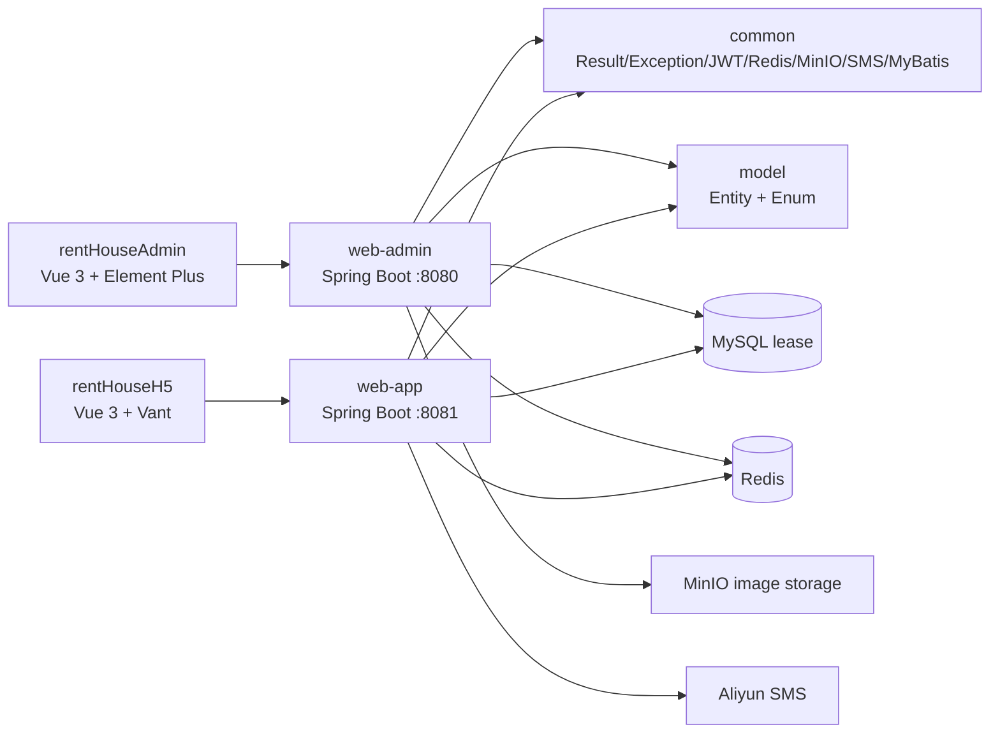
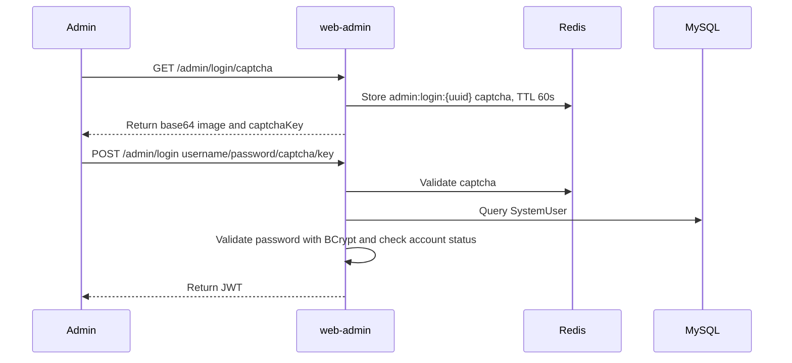

# Lease Rental System Design Document

## 1. Purpose

This document is based on the current repository code. It explains the overall architecture, module responsibilities, core business flows, data model, API boundaries, runtime dependencies, and known risks of the Lease rental system. It is intended for backend, frontend, and future maintenance engineers, helping them quickly understand how the system supports mobile user room search, appointments, and lease management from the admin-side property management workflow.

## 2. System Overview

Lease is an apartment rental system consisting of a Java backend and two Vue frontends.

- The backend uses a Maven multi-module structure. Core modules include `model`, `common`, `web/web-admin`, and `web/web-app`.
- The admin backend `web-admin` runs on port `8080` and provides admin login, property, apartment, room, lease, appointment, system staff, post, user status, and file upload APIs.
- The user-facing backend `web-app` runs on port `8081` and provides SMS login, room search, apartment/room detail, viewing appointment, my appointments, my leases, renewal, browsing history, and related APIs.
- The admin frontend is located at `frontend/rentHouseAdmin` and is built with Vue 3, TypeScript, Pinia, and Element Plus.
- The H5/mobile frontend is located at `frontend/rentHouseH5` and is built with Vue 3, TypeScript, Pinia, and Vant.

## 3. Overall Architecture



The system follows a typical layered architecture:

- The Controller layer handles HTTP APIs, request parameter binding, and unified responses.
- The Service layer handles business validation, domain workflows, transactions, and cross-table aggregation.
- The Mapper layer handles MyBatis-Plus basic CRUD and XML-based custom queries.
- The Entity/Enum layer is located in `model` and acts as the shared data model for both backend applications.
- The VO layer is used for API input and output, including multi-table aggregated results and composite submission objects.

## 4. Code Module Design

### 4.1 Backend Modules

| Module | Path | Responsibility |
| --- | --- | --- |
| Parent project | `pom.xml` | Centralizes versions for Java 21, Spring Boot 3.2.10, MyBatis-Plus, JWT, Knife4j, MinIO, SMS, Lombok, and related dependencies |
| Model module | `model` | Defines database entities, the base entity `BaseEntity`, and business enums |
| Common module | `common` | Provides unified responses, exceptions, JWT, Redis cache, MyBatis-Plus configuration, MinIO, SMS, password encoder, and other shared infrastructure |
| Web aggregator module | `web` | Manages the `web-admin` and `web-app` submodules and shares Spring Web, test, Knife4j, and MyBatis-Plus dependencies |
| Admin API | `web/web-admin` | Admin APIs, login authentication, file upload, and scheduled lease expiration task |
| User API | `web/web-app` | H5/API-side login, room search, appointment, lease, and browsing history APIs |

### 4.2 Frontend Modules

| Frontend | Path | Tech Stack | Responsibility |
| --- | --- | --- | --- |
| Admin console | `frontend/rentHouseAdmin` | Vue 3, TypeScript, Pinia, Vue Router, Element Plus, Axios | Property, room, attribute, appointment, lease, system user, post, and user management |
| H5/mobile client | `frontend/rentHouseH5` | Vue 3, TypeScript, Pinia, Vue Router, Vant, Axios | Room search, room/apartment details, appointments, my room, messages, user center, browsing history, and leases |

## 5. Domain Model

### 5.1 Base Entity

Most primary entities extend `BaseEntity`, which contains:

- `id`: auto-increment primary key.
- `createTime`: automatically filled on insert.
- `updateTime`: automatically filled on update.
- `isDeleted`: MyBatis-Plus logical deletion field.

### 5.2 Core Entities

| Domain | Entities | Description |
| --- | --- | --- |
| Region | `ProvinceInfo`, `CityInfo`, `DistrictInfo` | Province/city/district hierarchy |
| Apartment | `ApartmentInfo` | Apartment basic information, location, contact phone, and release status |
| Room | `RoomInfo` | Room number, rent, apartment ownership, and release status |
| Image | `GraphInfo` | Distinguishes apartment and room images by `ItemType` |
| Label | `LabelInfo`, `ApartmentLabel`, `RoomLabel` | Apartment/room labels and relationships |
| Facility | `FacilityInfo`, `ApartmentFacility`, `RoomFacility` | Apartment/room facilities and relationships |
| Attribute | `AttrKey`, `AttrValue`, `RoomAttrValue` | Room attribute keys, values, and room relationships |
| Fee | `FeeKey`, `FeeValue`, `ApartmentFeeValue` | Apartment miscellaneous fee items and values |
| Payment and term | `PaymentType`, `LeaseTerm`, `RoomPaymentType`, `RoomLeaseTerm` | Payment methods, available lease months, and room-level availability |
| User | `UserInfo` | H5 user account, logged in by phone number |
| Staff | `SystemUser`, `SystemPost` | Admin staff and posts |
| Appointment | `ViewAppointment` | User viewing appointment records |
| Lease | `LeaseAgreement` | Contract information, term, rent, deposit, payment method, status, and source |
| Browsing history | `BrowsingHistory` | User room browsing records |

### 5.3 Main Enums

| Enum | Description |
| --- | --- |
| `BaseStatus` | General enabled/disabled status |
| `ReleaseStatus` | Apartment and room release status |
| `ItemType` | Apartment or room, used for image, label, and facility ownership |
| `AppointmentStatus` | Viewing appointment status |
| `LeaseStatus` | Lease status, such as signing, signed, withdrawing, expired, and related states |
| `LeaseSourceType` | Lease source |
| `SystemUserType` | Admin user type |

## 6. Key Business Design

### 6.1 Admin Login

The admin login flow is implemented by `LoginServiceImpl` in `web-admin`.



After authentication succeeds, admin APIs are protected by `LoginInterceptor`, which intercepts `/admin/**` and excludes `/admin/login` and `/admin/login/captcha`. The interceptor reads `Authorization: Bearer <token>`, parses the JWT, stores the user id in `LoginUserHolder`, and clears ThreadLocal after the request completes.

The admin frontend request interceptor and image upload component use the same authentication contract:

```http
Authorization: Bearer <token>
```

### 6.2 User SMS Login

User-side login is implemented by `LoginServiceImpl` and `SmsServiceImpl` in `web-app`.

- Phone numbers are validated with the regex `^1[3-9]\d{9}$`.
- Redis key `app:login:resend:{phone}` limits repeated SMS requests within 60 seconds.
- Redis key `app:login:{phone}` stores the verification code with a 60-second TTL.
- Redis key `app:login:attempt:{phone}` records wrong-code attempts. Its TTL matches the verification code TTL, 60 seconds, and the maximum attempt count is 5.
- If the phone number is not registered after verification succeeds, the system automatically creates a `UserInfo` record, sets the nickname to `新用户` plus the last four digits of the phone number, and uses the newly created user record to generate the JWT.
- After login succeeds, a JWT is returned. The user-side interceptor stores both `userId` and phone number in ThreadLocal.

### 6.3 Apartment Management

Apartment create/update uses `ApartmentSubmitVo` as the submission object. The main table is `apartment_info`, and the following relationships are maintained at the same time:

- `apartment_facility`
- `apartment_label`
- `apartment_fee_value`
- `graph_info` rows with `item_type = APARTMENT`

For updates, the current implementation deletes old relationships first and then batch-inserts the new relationships to rebuild many-to-many data. `saveOrUpdateByApartment` is wrapped with `@Transactional`, covering main-table and relationship-table writes and reducing the risk of partially written data. Apartment list queries use `ApartmentInfoMapper.xml` to aggregate display fields such as total room count and free room count.

### 6.4 Room Management

Room create/update uses `RoomSubmitVo` as the submission object. The main table is `room_info`, and the following data is maintained at the same time:

- Room images in `graph_info(item_type = ROOM)`
- Room attributes in `room_attr_value`
- Room facilities in `room_facility`
- Room labels in `room_label`
- Room payment methods in `room_payment_type`
- Room lease terms in `room_lease_term`

Room details are aggregated in the Service layer from room, apartment, images, attributes, facilities, labels, payment methods, and lease terms. The admin side caches room details in Redis. Updating a room, deleting a room, or changing a room release status evicts the corresponding detail cache through `@CacheEvict`. The room save method uses `@Transactional` to keep the main table and multiple relationship tables consistent.

### 6.5 User Room Search and Details

The H5 room list API `/app/room/pageItem` supports filtering by region, rent range, payment method, and rent sort order. `RoomInfoMapper.xml` uses MyBatis-Plus pagination and XML-based custom queries. The list result uses `resultMap` nested queries to populate room images, labels, and apartment information.

Room detail API `/app/room/getDetailById` aggregates:

- Room basic information
- Owning apartment basic information, labels, images, and minimum rent
- Room images
- Room attributes and attribute names
- Room facilities and labels
- Payment methods, miscellaneous fees, and lease terms

Apartment-specific room pagination uses `/app/room/pageItemByApartmentId`, and both frontend and backend use the request parameter `apartmentId`.

### 6.6 Viewing Appointments

Users create or update viewing appointments through `/app/appointment/saveOrUpdate`. The "my appointments" list is returned in descending appointment-time order and aggregates apartment name and apartment images. Appointment detail queries use both the current logged-in user id and appointment id, preventing users from reading other users' appointments.

The admin side queries appointments through `/admin/appointment/page`, supporting filters by province, city, district, apartment, name, and phone number. It can update appointment status through `/admin/appointment/updateStatusById`.

### 6.7 Lease Management

The admin lease module supports:

- `/admin/agreement/page`: paginated lease query with room, apartment, payment method, and lease term associations.
- `/admin/agreement/saveOrUpdate`: create or edit a lease.
- `/admin/agreement/updateStatusById`: update lease status.
- `/admin/agreement/removeById`: delete a lease.

The user lease module supports:

- `/app/agreement/listItem`: query leases for the current phone number.
- `/app/agreement/getDetailById`: query detail for a specified lease under the current phone number.
- `/app/agreement/updateStatusById`: allow users to confirm signing or request withdrawal within valid state transitions.
- `/app/agreement/renew`: request lease renewal.

Current user-side lease ownership is mainly bound through `LeaseAgreement.phone` and the phone number stored in the JWT.

### 6.8 Browsing History

The user side writes browsing records through `/app/history/saveHistory` and queries them with pagination through `/app/history/pageItem`. The browsing history list aggregates room number, rent, room images, apartment name, and region information.

### 6.9 Lease Expiration Task

`ScheduleTasks` in `web-admin` runs every day at midnight:

- It queries leases whose status is signed or withdrawing.
- If `lease_end_date <= current time`, it updates the lease status to `EXPIRED`.

## 7. API Design Overview

### 7.1 Admin APIs

| Module | API Prefix | Main Capabilities |
| --- | --- | --- |
| Login | `/admin/login`, `/admin/info` | Image captcha, login, and current admin information |
| Region | `/admin/region` | Province/city/district lists |
| Apartment | `/admin/apartment` | Apartment save, pagination, detail, deletion, release status, and list-by-district |
| Room | `/admin/room` | Room save, pagination, detail, deletion, release status, and list-by-apartment |
| Attribute | `/admin/attr` | Attribute key/value save, list, and deletion |
| Label | `/admin/label` | Label list, save, and deletion |
| Facility | `/admin/facility` | Facility list, save, and deletion |
| Fee | `/admin/fee` | Miscellaneous fee key/value save, list, and deletion |
| Payment method | `/admin/payment` | Payment method list, save, and deletion |
| Lease term | `/admin/term` | Lease term list, save, and deletion |
| File | `/admin/file/upload` | Image upload to MinIO |
| Appointment | `/admin/appointment` | Appointment pagination and status update |
| Lease | `/admin/agreement` | Lease pagination, detail, save, deletion, and status update |
| User | `/admin/user` | H5 user pagination and status update |
| System staff | `/admin/system/user` | Staff pagination, detail, save, username availability check, deletion, and status update |
| Post | `/admin/system/post` | Post pagination, list, detail, save, deletion, and status update |

### 7.2 H5 User APIs

| Module | API Prefix | Main Capabilities |
| --- | --- | --- |
| Login | `/app/login`, `/app/info` | SMS verification code, phone login, and user information |
| Region | `/app/region` | Province/city/district lists |
| Room | `/app/room` | Room pagination, detail, and pagination by apartment |
| Apartment | `/app/apartment` | Apartment detail |
| Payment method | `/app/payment` | Payment method list and room-specific query |
| Lease term | `/app/term` | Room-specific lease term query |
| Appointment | `/app/appointment` | Save appointment, my appointments, and appointment detail |
| Lease | `/app/agreement` | My leases, lease detail, status update, and renewal |
| Browsing history | `/app/history` | Save and paginate browsing history |

## 8. Data Access Design

The system uses MyBatis-Plus for basic CRUD, logical deletion, pagination interception, and automatic field filling. Complex list queries are implemented through XML mappers:

- Admin apartment list: counts total rooms and free rooms.
- Admin room list: joins apartments and leases and computes whether a room is occupied.
- Admin lease pagination: joins rooms, apartments, payment methods, and lease terms.
- Admin appointment pagination: joins apartments.
- H5 room list: uses nested queries to return images, labels, and apartment information.
- H5 browsing history pagination: joins rooms and apartments and separately queries room images.

The VO design has two main responsibilities:

- Submission VOs, such as `ApartmentSubmitVo` and `RoomSubmitVo`, submit a main table and multiple relationship tables in one request.
- Display VOs, such as `RoomDetailVo`, `ApartmentItemVo`, and `AgreementDetailVo`, combine multi-table query results for frontend responses.

## 9. Cache and External Dependencies

### 9.1 Redis

Redis is used for:

- Admin image captcha.
- User SMS verification code, resend limit, and wrong-attempt limit.
- Spring Cache method caching.

Cache namespaces are defined in `CacheNames`:

- Admin detail caches: `admin:room:detail` and `admin:apartment:detail`, TTL 20 minutes.
- User detail caches: `app:room:detail` and `app:apartment:detail`, TTL 60 minutes.
- User-side basic dictionary caches: region 12 hours, labels and facilities 2 hours.

### 9.2 MinIO

Admin file upload writes to MinIO through `FileUploadController` and `FileServiceImpl`. Configuration items include:

- `minio.endpoint`
- `minio.access-key`
- `minio.secret-key`
- `minio.bucket-name`

### 9.3 Aliyun SMS

User-side SMS sending uses the Aliyun `dysmsapi20170525` client. Configuration items include:

- `aliyun.sms.access-key-id`
- `aliyun.sms.access-key-secret`
- `aliyun.sms.endpoint`
- `aliyun.sms.sign-name`
- `aliyun.sms.template-code`

### 9.4 JWT

JWT configuration includes:

- `jwt.issuer`: `web-admin` for the admin side and `web-app` for the user side.
- `jwt.secret-key`: read from `JWT_SECRET_KEY`.
- `jwt.ttl-seconds`: default value is 36000 seconds.

`JwtUtil` validates issuer, secret-key, and ttl during startup. The secret supports either Base64 or plain string format, and the decoded key must be at least 32 bytes.

## 10. Frontend Design

### 10.1 Admin Console

The admin console uses hash routing. Main pages include:

- Home `/index`
- System user `/system/user`
- Post `/system/post`
- Apartment management `/apartmentManagement/apartmentManagement/apartmentManagement`
- Room management `/apartmentManagement/roomManagement/roomManagement`
- Attribute management `/apartmentManagement/attributeManagement/attributeManagement`
- Viewing appointment management `/rentManagement/appointment/appointment`
- Lease management `/agreementManagement/agreement/agreement`
- User management `/userManagement/userManagement`

The Axios wrapper centrally handles API response codes, login expiration, error messages, and progress indication.

Admin requests and the upload component set `Authorization: Bearer <token>` when a token exists, matching the backend `LoginInterceptor`.

### 10.2 H5 User Client

The H5 user client uses `/search` as the default homepage. The bottom tabs include:

- Room search `/search`
- Community `/group`
- My room `/myRoom`
- Messages `/message`
- User center `/userCenter`

Other pages include room detail, apartment detail, appointment, my appointments, my leases, lease detail, browsing history, and login.

The request interceptor reads the local token and sends it to the backend as `Authorization: Bearer <token>`. The response interceptor handles login expiration and error messages based on response codes.

The apartment detail page loads the room list by calling `/app/room/pageItemByApartmentId` with the parameter name `apartmentId`, matching the backend Controller.

## 11. Runtime and Configuration

### 11.1 Backend Runtime

```bash
mvn clean install
mvn -pl web/web-admin spring-boot:run
mvn -pl web/web-app spring-boot:run
```

### 11.2 Frontend Runtime

```bash
cd frontend/rentHouseAdmin
npm install
npm run dev

cd frontend/rentHouseH5
npm install
npm run dev
```

### 11.3 Local Dependencies

Default local configuration dependencies:

- MySQL: `localhost:3306/lease`
- Redis: `localhost:6379`
- MinIO: `localhost:9000`
- JWT environment variable: `JWT_SECRET_KEY`
- Aliyun SMS environment variables: `ALIYUN_SMS_ACCESS_KEY_ID`, `ALIYUN_SMS_ACCESS_KEY_SECRET`

## 12. Current Test Coverage

The repository currently contains some backend tests:

- `web/web-admin/src/test/java/com/nocompanyname/lease/schedule/ScheduleTasksTest.java`
- `web/web-app/src/test/java/com/nocompanyname/lease/web/app/controller/history/BrowsingHistoryControllerTest.java`
- `web/web-app/src/test/java/com/nocompanyname/lease/web/app/service/impl/BrowsingHistoryServiceImplTest.java`
- `web/web-app/src/test/java/com/nocompanyname/lease/web/app/service/impl/LoginServiceImplTest.java`
- `web/web-app/src/test/java/com/nocompanyname/lease/web/app/service/impl/SmsServiceImplTest.java`

Recommended test focus areas:

- Login and verification code: Redis TTL, wrong-attempt count, automatic registration, and disabled accounts.
- Property details aggregation: images, labels, facilities, attributes, payment methods, and lease terms.
- Appointment and lease ownership: all queries must filter by the current logged-in user.
- Lease status transitions: user confirmation, withdrawal request, admin status changes, and scheduled expiration.
- Mapper pagination queries: filters, logical deletion, total count, and JOIN results.

In the current scan, `LoginServiceImplTest` already covers user-side SMS login resend limitation, verification code storage and sending, wrong-code TTL, successful code consumption, automatic missing-user registration with token return, and disabled-account rejection.

## 13. Future Evolution Plan

- Add integration tests for apartment/room composite saves, lease status transitions, and appointment ownership.
- Move sensitive configuration to environment variables or a configuration center.
- Define explicit cache invalidation strategies for common list and detail APIs.
- Extract repeated aggregation logic for images, labels, facilities, payment methods, and lease terms to reduce Service-layer duplication.
- Add database schema scripts or a migration tool to reduce new-environment setup cost.
